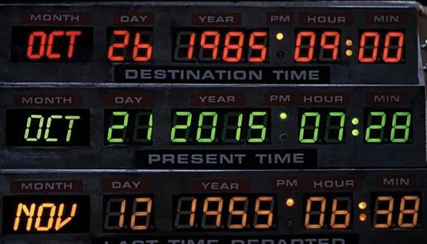

Last month, I gave a talk about [*Immutability for functional JavaScript* in the DublinJS meetup (slides)](https://slides.maxpou.fr/immutability-js/).  
I discovered Immutability almost 2 years ago in a French Meetup dedicated to Functional Programming but I didn't gave a try. 6 months later, after another talk, I decided to learn and understand this paradigm. It changed my way of writing code, mostly, when I started to adopt Immutability as a rule of thumb.

## Immutability? Kezako?

If you follow the JavaScript trends, you probably heard about **functional programming**. It's getting popular since the ES2015 version of JavaScript. Immutability is one pillar of this paradigm. The notion behind is very simple: *"Forget about variables, everything is a constant"*. You're manipulating a list of users? Put them into a constant. You want to add an users? The list must be another structure.

```javascript
var heroName = 'Logan'
heroName     = 'Groot' // 🚫 Unauthorized!
```


## Why Immutability is important?

### Unwanted mutations

Let's take our first example with Moment. Moment is a really nice library to manage your date in JS. The first time I was using it, I fall into a classic trap: an unwanted mutation.:

```javascript
const today = moment()
const nextYear = today.add(1, 'years')

today === nextYear // true
```

By mistake -and because I didn't read the full documentation :) - I changed the value of today (see last line).

### Mutables variables give you headache

> Mutable state is the new spaghetti code  
— **Rich Hickey, author of Clojure**

Given a function `hulkify()` in a Hero class like the following one.

```javascript
class Hero {
  constructor () {
    this.color = 'beige'
    this.strengh = 1
  }

  hulkify () {
    this.color = 'green'
    this.strengh = 1000
  }
}
```

and a code like this:

```javascript
const bruceBanner = new Hero()
// ... do something ...
bruceBanner.goToRestaurant()
// ... do something ...
bruceBanner.hulkify() // bring mutation
// ... do something ...
bruceBanner.fight()
```

The previous examples bring severals problems:
* after mutation, the variable's name and her associated values doesn't match anymore. After `bruceBanner.hulkify()`, `bruceBanner` became Hulk. For a better readability/maintainability, it deserves it own variable.
* what if I reorder the functions calls? Then, I will send Hulk in a restaurant and the Human version of Bruce Banner in a fight...

If data have some mutations, you have to keep in mind the mutation order.


### Time traveling



There is a really nice pattern called CQRS *(Command Query Responsibility Segregation)*. The starting point is the following: editing something may be harmful. Because mutation hide change.
So this pattern consist in removing any update/delete statement only create. If you take a look, that exactly how Git works. If you delete some code, you can retrieve it later.

```javascript
const heroPet[] = 'cat'
hero.play(heroPet[heroPet.length - 1])
// later
const heroPet[] = 'dragon'
hero.play(heroPet[heroPet.length - 1])
```

This approach will allow the hero to play with his previous pet, even if he change it!


### Thread safety?

One last advantage for moving into immutable object is the Thread safety. On a multi-threaded application, two threads can manipulate 2 different versions of one data structure. However, JavaScript is concurrent by default, so we're not really impacted by this aspect (I didn't try with [parallel.js](https://parallel.js.org/)).


## Pitfalls & Misconceptions

### `const` is not about immutability

ES2015 came with a new nice keyword: `const`.

> Constants are block-scoped, much like variables defined using the let statement. The value of a constant cannot change through re-assignment, and it can't be redeclared.  
— **[MDN](https://developer.mozilla.org/en-US/docs/Web/JavaScript/Reference/Statements/const)**


It means, once a constant is declared, you cannot change it.

```javascript
const meaningOfLife = 42
meaningOfLife = 'boom' // Uncaught TypeError: Assignment to constant variable
```

Then came a big confusion on the internets. People start to think that `const` was made for immutable structures.
In fact `const` only create an immutable binding between the identifier and the value. If you assign an object as a value, you're free to change this object.

```javascript
const hero = {
  name: 'Batman'
}

hero.name: 'Daredevil'

console.log(hero) // Object {name: "Daredevil"}
```

The object signature is still the same, only his parameters change. But it's not an excuse for not using it!


### mutable states inside `map()`

To loop an array, [forget about for/while loop](https://www.maxpou.fr/no-more-loop-in-js/) and start using Array.prototype.map(). Array.prototype.forEach() is a sibling to map() but it create side effect, while map prevent them by creating a new structure. Now, map() looks cool right? I can do some operations with my objects in a Array.map() loop, and it will preserve my initial values? Well... not exactly!

```javascript
const newHeroes = heroes.map(h => {
  h.name = h.name.toUpperCase()
  return h
})

console.table(newHeroes) // newHeroes now contains name in uppercase 👍
console.table(heroes)    // heroes now contains name in uppercase 👎
```

As expected, I created a new structure of heroes with a toString property.  
But JavaScript always pass variables by value... except when this variable refer to an object. And almost everything is an object in JS!
In the map() loop, `h` refer to a hero reference. That why the heroes are updated!


## Solutions

Hopefully, JavaScript offer severals quick wins to deal with immutability. To keep everything consistent, I'm gonna use the following structure for this functions:

```javascript
const hero = {
  name: 'Daredevil',
  location: {
    city: 'New York',
    district: 'Kitchen Hell'
  }
}
```

### Object.freeze() vs. Object.seal() vs. Object.assign() vs. Object Spread Properties

* **[Object.freeze()](https://developer.mozilla.org/en/docs/Web/JavaScript/Reference/Global_Objects/Object/freeze)**: freeze the given object (only the first level)

    ```javascript
    Object.freeze(hero)

    hero.name = 'Jessica Jones'
    console.log(hero.name === 'Jessica Jones') // false (hero is unchanged)

    hero.location.city = 'Dublin'
    console.log(hero.location.city === 'Dublin') // true (hero.location has been changed)
    ```

* **[Object.seal()](https://developer.mozilla.org/en/docs/Web/JavaScript/Reference/Global_Objects/Object/seal)**: prevent adding new properties to a given object

    ```javascript
    Object.seal(hero)

    hero.weapon = 'staff'
    console.log(hero.weapon) // undefined (hero is unchanged)

    hero.name = 'Jessica Jones'
    console.log(hero.name === 'Jessica Jones') // true (hero.name has been changed)
    ```

* **[Object.assign()](https://developer.mozilla.org/en/docs/Web/JavaScript/Reference/Global_Objects/Object/assign)**: create copy of a given object

    ```javascript
    const newHero = Object.assign({}, hero)

    newHero.name = 'Jessica Jones'
    console.log(hero.name === 'Jessica Jones') // false (hero is unchanged)

    newHero.location.city = 'Dublin'
    console.log(hero.location.city === 'Dublin') // true (hero.location has been changed)
    ```

* **[Object Spread Properties - Stage 3 (Draft)](https://github.com/tc39/proposal-object-rest-spread)**: an alternative to Object.assign() - currently in stage 3 (only available through compilers: Babel, TypeScript...).

    ```javascript
    const newHero = {
      ...hero,
      name: 'Jessica Jones'
    }
    console.log(hero.name === newHero.name) // false (hero is unchanged)

    newHero.location.district = 'Dublin'
    console.log(hero.location.city === 'Dublin') // true (hero.location has been changed)
    ```


Whatever we use, we always face the same problem: we need a **deep clone**. Usually theses deep clone/copy methods use recursion.


### And what about JSON?

When we Google the following term: *Immutable + Javascript*, some StackOverflow results redirects to **JSON.parse(JSON.stringify())**. At first sight, it could be interesting because it solves all previous problems.

```javascript
const hero = {
  name: 'Daredevil',
  location: {
    city: 'New York',
    district: 'Kitchen Hell'
  }
}
const newHero = JSON.parse(JSON.stringify(hero)) // "{"name":"Daredevil", {...}}"

newHero.name = 'Jessica Jones'
console.log(hero.name === 'Daredevil') // true (hero in unchanged)

newHero.location.city = 'Dublin'
console.log(hero.location.city === 'Dublin') // true (hero.location in unchanged)
```

🎉 Tadaaa!

Well... I have a bad news: JSON for **JavaScript** Standard Object Notation* is a **language agnostic format**. Yes. Really!

> It does not attempt to impose ECMAScript’s internal data representations on other programming languages.  
— **[Final draft of the TC39 “The JSON Data Interchange Format” standard](http://www.ecma-international.org/publications/files/ECMA-ST/ECMA-404.pdf)** *(look at the introduction)*

After, it's makes sence. Ruby/Scala/Python/PHP/... should not implement some Javascript specificities such as Symbols, undefined... or even the functions!


**How are handle non-stringifiable types?**

They are simply removed.

```javascript
const hero = {
  name: 'Daredevil',
  birthdate: new Date(1989, 4, 11),
  sayHello: () => 'hello',
  symbol: Symbol(),
  banana: undefined
}
JSON.parse(JSON.stringify(hero)) // "{"name":"Daredevil", birthdate: "1989-05-10T23:00:00.000Z"}"
```

**How are handle circular references**

Circular references simply generate errors.

```javascript
const daredevil = {
    friends: [daredevil]
}

JSON.parse(JSON.stringify(daredevil))
// Uncaught TypeError: Converting circular structure to JSON
```

So for both of this reason, I would recommend to use this with an extreme precaution.


## Persistent data structure

I now want to save the world against a big attack. Let's grab my heroes. Yes, ALL of them!

```javascript
const heroes = [
  ⋮
  { name: 'Wolverine', isReady: false, /* ... others properties ... */ },
  { name: 'Deadpool', isReady: false,  /* ... others properties ... */ },
  { name: 'Magneto', isReady: false,   /* ... others properties ... */ },
  { name: 'Gandalf', isReady: true,   /* ... others properties ... */ },
  ⋮
  (100 000 heroes)
]
```

Oops, I need them to get ready.

```javascript
heroes.map(h => {
  const newHero = Object.assign({}, hero)
  newHero.isReady = true
  return newHero
})
```

To update just one field, I have to create 100 000 copies of my objects. And also, duplicate a lot of unchanged properties, including the Hero Gandalf which is already prepared...
We are going to face performances issues... there is probably a better way to do it!

If you have this problem, it's time to switch to libraries such as [Immutable.js](https://facebook.github.io/immutable-js/) or [Mori](http://swannodette.github.io/mori/#title)
