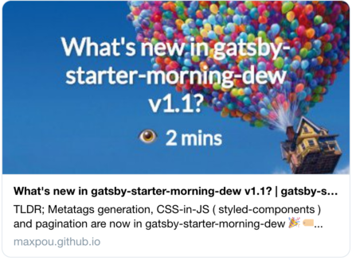

It's now posible to generate preview images for social networks ([Twitter](https://cards-dev.twitter.com/validator) and Facebook).



This great idea come from a [conversation](https://twitter.com/_maxpou/status/1054106299213012992) I had with Luciano Mammino (aka [@Loige](https://twitter.com/loige)). I basically took 85% of his code. Thanks Luciano 😊


**How to do it?**

1. In a terminal, run `npm run dev`.
2. In a second terminal, run: `npm run generatePostPreviewImages`
3. In the post's header, add the generated images:
  ```yaml
  title: My blog post
  # ...
  imageTw: ./gatsby-starter-morning-dew-v1-1-tw.png
  imageFb: ./gatsby-starter-morning-dew-v1-1-fb.png
  ```

Gatsby will first create extra url suffixed by `/image_tw` and `/image_fb` (i.e. *http://localhost:8000/gatsby-starter-morning-dew-v1-1/image_tw*). Then, Pupetter will take a snapshot and add it to your post folder.

**Quick tip:** If you want to recreate this pictures

```bash
# delete Facebook images
find ./content -name "*-fb.png" -type f -delete
# delete Twitter images
find ./content -name "*-tw.png" -type f -delete
```

If you don't to skip the file generation for some posts, add `generate-card: false` to the post's header.

```yaml
---
title: My blog post
# ...
generate-card: false
---
```
